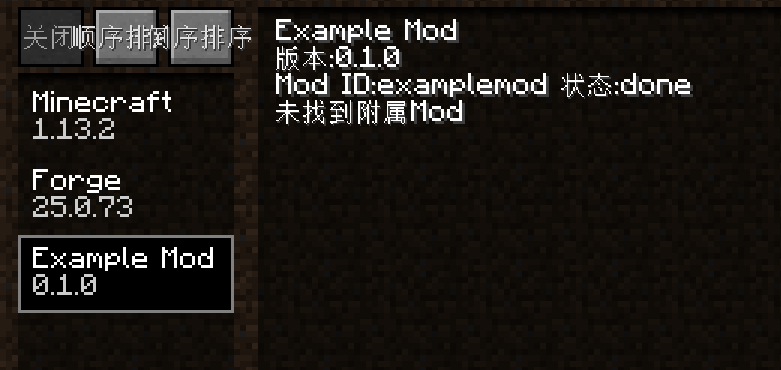

# 第一个mod

## 主类
新版的forge，@mod注解只需要写上一个内容——modid即可，我们有如下的代码:

```JAVA
    package com.example.examplemod;

    import net.minecraftforge.fml.common.Mod;

    @Mod("examplemod")
    public class ExampleMod
    {
        
    }
```

## 配置文件
新版的forge配置文件改为了toml格式，语法和之前不太一样，但是一个最基本的mod应该有以下内容:

```
    modLoader="javafml"
    loaderVersion="[25,)"
    [[mods]]
    modId="examplemod"
    version="0.1.0"
    displayName="Example Mod"
```

其中modId部分和@mod注解的需要一致，其他就是自己mod的情况。

## 效果
